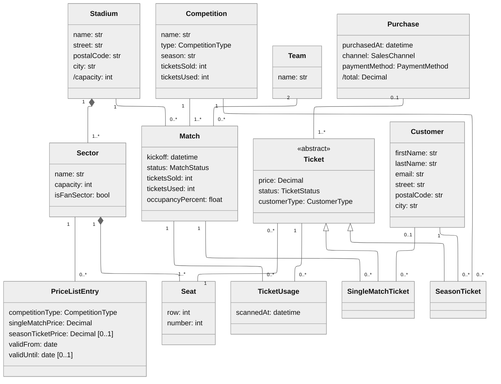
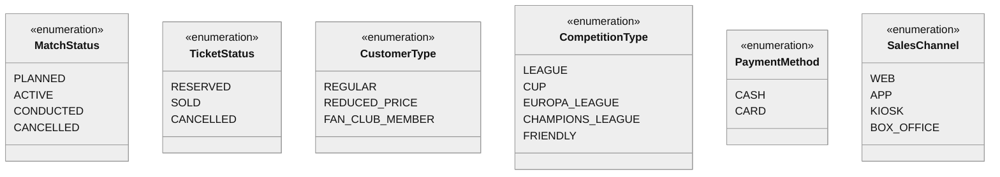

# Class diagram (business objects)

Ticket stores the customer type; Customer has no type.

```mermaid
---
config:
  theme: neutral
  class:
    useMaxWidth: false
  layout: elk
  elk:
    forceNodeModelOrder: false
    considerModelOrder: NODES_AND_EDGES
    nodePlacementStrategy: NETWORK_SIMPLEX
---
classDiagram
  direction TB
  class Stadium {
    name: str
    street: str
    postalCode: str
    city: str
    /capacity: int
  }
  class Competition {
    name: str
    type: CompetitionType
    season: str
    ticketsSold: int
    ticketsUsed: int
  }
  class Team {
    name: str
  }
  class Purchase {
    purchasedAt: datetime
    channel: SalesChannel
    paymentMethod: PaymentMethod
    /total: Decimal
  }
  class Sector {
    name: str
    capacity: int
    isFanSector: bool
  }
  class PriceListEntry {
    competitionType: CompetitionType
    singleMatchPrice: Decimal
    seasonTicketPrice: Decimal [0..1]
    validFrom: date
    validUntil: date [0..1]
  }
  class Match {
    kickoff: datetime
    status: MatchStatus
    ticketsSold: int
    ticketsUsed: int
    occupancyPercent: float
  }
  class Ticket {
    <<abstract>>
    price: Decimal
    status: TicketStatus
    customerType: CustomerType
  }
  class Customer {
    firstName: str
    lastName: str
    email: str
    street: str
    postalCode: str
    city: str
  }
  class Seat {
    row: int
    number: int
  }
  class TicketUsage {
    scannedAt: datetime
  }
  class SingleMatchTicket
  class SeasonTicket
  Stadium "1" *-- "1..*" Sector
  Stadium "1" -- "0..*" Match
  Team "2" -- "0..*" Match
  Competition "1" -- "1..*" Match
  Competition "1" -- "0..*" SeasonTicket
  Purchase "0..1" -- "1..*" Ticket
  Sector "1" *-- "1..*" Seat
  Sector "1" -- "0..*" PriceListEntry
  Ticket "0..*" -- "1" Seat
  Ticket <|-- SingleMatchTicket
  Ticket <|-- SeasonTicket
  Ticket "1" -- "0..*" TicketUsage
  Match "1" -- "0..*" SingleMatchTicket
  Match "1" -- "0..*" TicketUsage
  Customer "0..1" -- "0..*" SingleMatchTicket
  Customer "1" -- "0..*" SeasonTicket
```

## Enumerations

```mermaid
---
config:
  theme: neutral
  class:
    useMaxWidth: false
---
classDiagram
  direction TB
  class MatchStatus {
    <<enumeration>>
    PLANNED
    ACTIVE
    CONDUCTED
    CANCELLED
  }
  class TicketStatus {
    <<enumeration>>
    RESERVED
    SOLD
    CANCELLED
  }
  class CustomerType {
    <<enumeration>>
    REGULAR
    REDUCED_PRICE
    FAN_CLUB_MEMBER
  }
  class CompetitionType {
    <<enumeration>>
    LEAGUE
    CUP
    EUROPA_LEAGUE
    CHAMPIONS_LEAGUE
    FRIENDLY
  }
  class PaymentMethod {
    <<enumeration>>
    CASH
    CARD
  }
  class SalesChannel {
    <<enumeration>>
    WEB
    APP
    KIOSK
    BOX_OFFICE
  }
```
